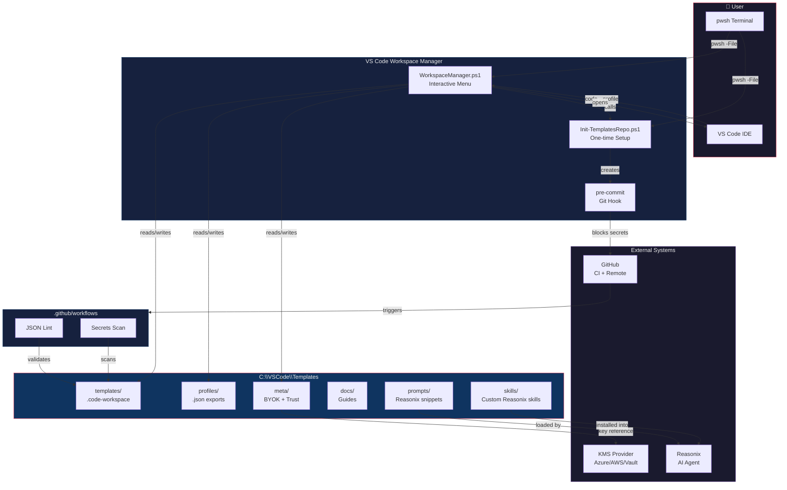
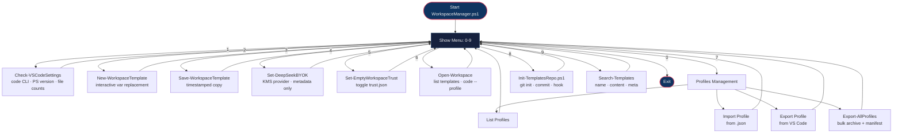
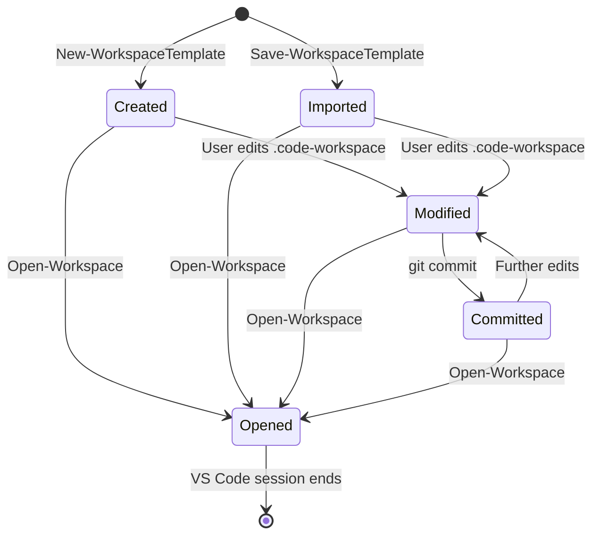
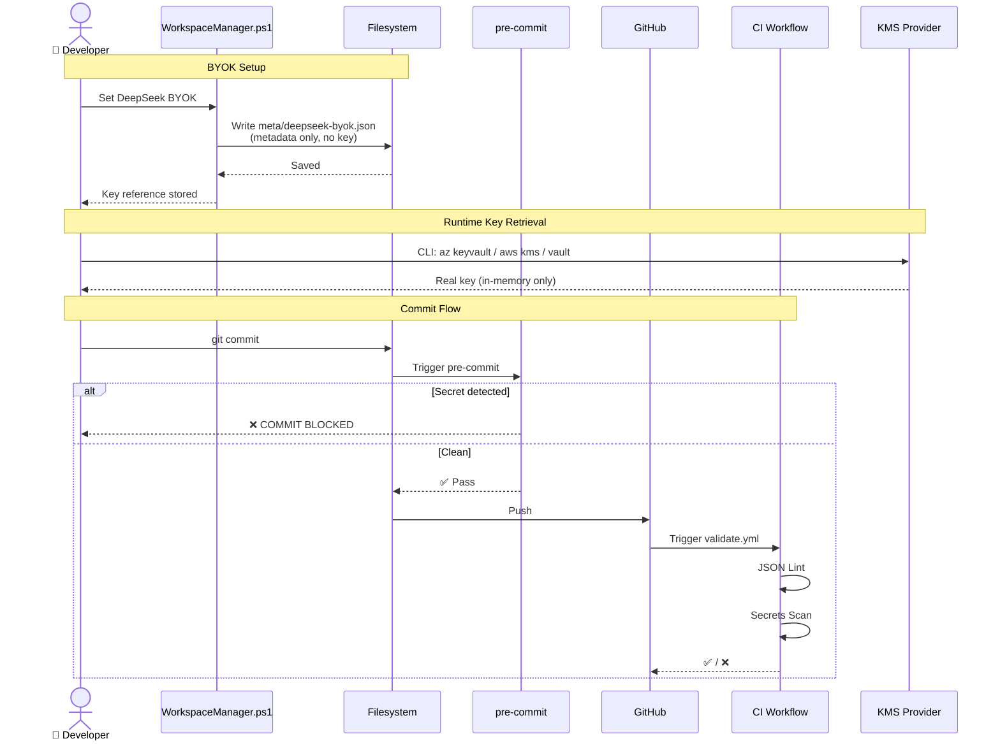
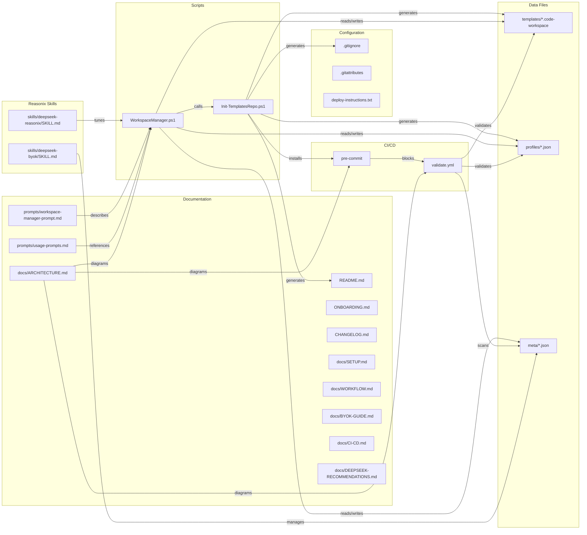

# Architecture & UML — VS Code Workspace Manager

## 1. System Architecture (Component Diagram)



---

## 2. WorkspaceManager Interactive Flow



---

## 3. Template Lifecycle (State Machine)



---

## 4. Security Chain (Sequence Diagram)



---

## 5. File Dependency Map



---

## 6. Data Structures

### meta/deepseek-byok.json
```json
{
  "version": "1.0",
  "provider": "azure-keyvault | aws-kms | hashicorp-vault | placeholder",
  "status": "configured | placeholder",
  "createdAt": "ISO 8601 timestamp",
  "keyReference": "URL/ARN/path — NOT the key itself",
  "kmsInstructions": {
    "azureKeyVault": { "command": "az keyvault ..." },
    "awsKms": { "command": "aws kms ..." },
    "hashicorpVault": { "command": "vault kv ..." }
  }
}
```

### meta/trust.json
```json
{
  "version": "1.0",
  "emptyWorkspaceTrust": false,
  "updatedAt": "ISO 8601 timestamp"
}
```

### templates/*.code-workspace
```json
{
  "folders": [{ "path": "." }],
  "settings": {},
  "extensions": { "recommendations": [] },
  "name": "${PROJECT_NAME}"
}
```

### profiles/*.json (VS Code Profile Export)
```json
{
  "name": "profile-name",
  "settings": "...",
  "extensions": "...",
  "keybindings": "...",
  "snippets": "..."
}
```

---

## 7. Key Design Decisions

| Decision | Rationale |
|----------|-----------|
| **BYOK stores metadata only** | No real keys on disk. `.gitignore` + pre-commit + CI as defense layers |
| **Separate init script** | One-time setup is idempotent; daily manager is interactive |
| **Template variables `${X}`** | Keeps templates generic; resolved at creation time |
| **Profiles as exported JSON** | VS Code native format; no custom serialization needed |
| **Pre-commit is a shell script** | Works on Windows (git bash) and any POSIX shell |
| **CI uses `ubuntu-latest`** | JSON lint + regex scan are OS-agnostic |
| **Skills are Reasonix-native** | Installable with `Install skill from:` — no custom packaging |
| **Mermaid for diagrams** | Renders in GitHub, VS Code, and any Markdown viewer |
