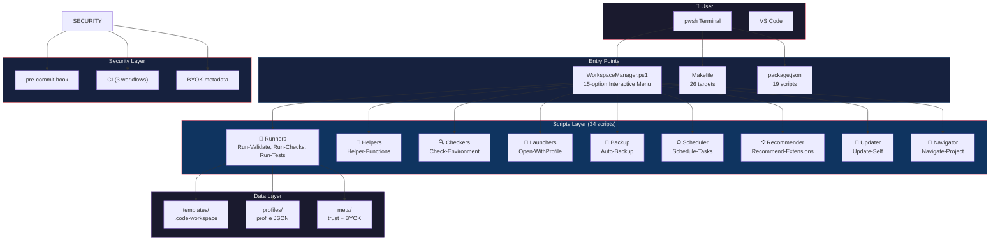
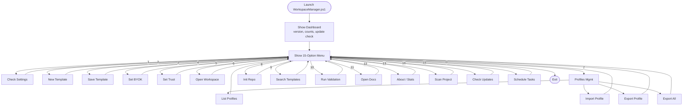
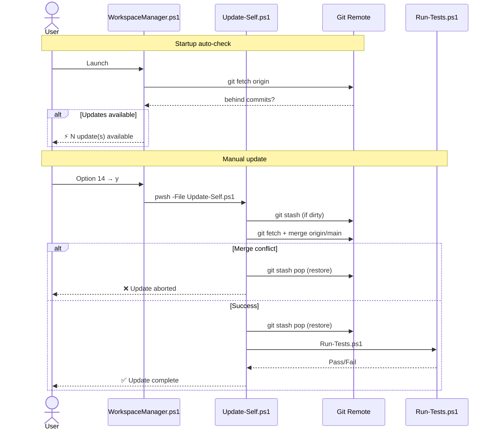
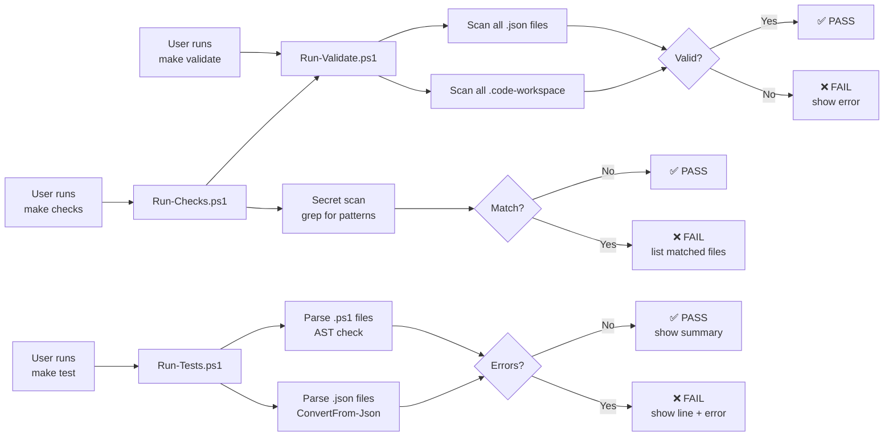
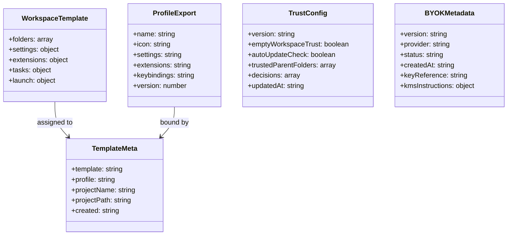
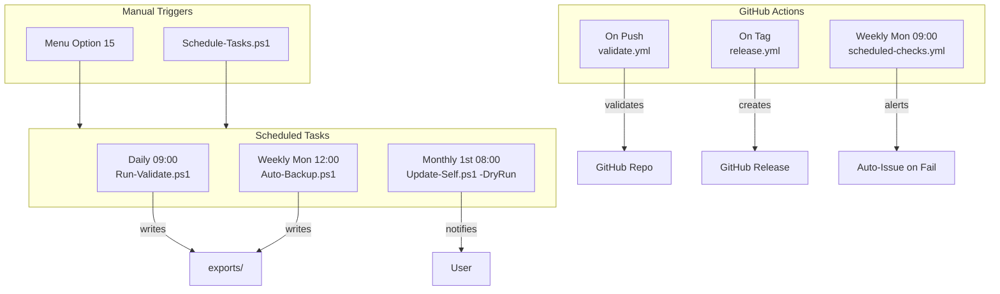
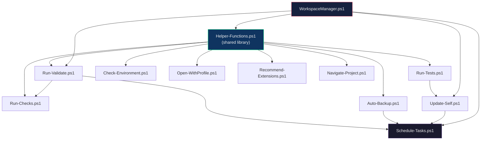
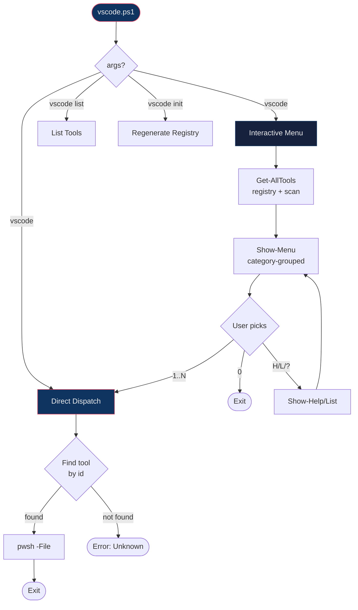

# UML Diagrams — VS Code Workspace Manager

All architecture diagrams in one place. Renders in GitHub, VS Code, and any Mermaid-compatible viewer.

---

## 1. System Architecture

---

## 2. Menu Option Flow

---

## 3. Self-Update Sequence

---

## 4. Validation Pipeline

---

## 5. Data Structures

---

## 6. Automation Flow

---

## 7. Script Dependency Graph

---

## 9. Universal Launcher (v1.1.0)

