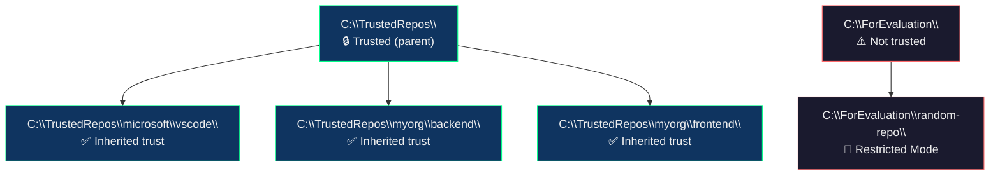

# Workspace Trust — Complete Guide

Based on the [official VS Code Workspace Trust documentation](https://code.visualstudio.com/docs/editing/workspaces/workspace-trust).

---

## What is Workspace Trust?

VS Code's security boundary between **code you trust** and **code you don't**. When a workspace is untrusted, VS Code enters **Restricted Mode** — blocking automatic code execution.

> **Golden rule:** When in doubt, leave a folder in Restricted Mode. You can always trust it later.

---

## Restricted Mode — What Gets Blocked

| Feature | Behavior in Restricted Mode |
|---------|---------------------------|
| **AI Agents** | Fully disabled — agents cannot run in untrusted workspaces |
| **Terminal** | Blocked by default — shells can auto-execute `.env` files |
| **Tasks** | Blocked — task definitions live in `.vscode/` and could be malicious |
| **Debugging** | Blocked — debug extensions launch arbitrary binaries |
| **Workspace Settings** | Filtered — settings that point to executables are disabled |
| **Extensions** | Disabled or limited unless they've opted into Workspace Trust |

---

## How Our System Integrates

### 1. Recording Trust Decisions

Our `meta/trust.json` records your trust posture:

```json
{
  "version": "1.0",
  "emptyWorkspaceTrust": false,
  "trustedParentFolders": [],
  "decisions": [
    {
      "path": "C:\\Projects\\my-app",
      "trusted": true,
      "rationale": "Internal project, reviewed by team",
      "date": "2026-06-23T10:00:00Z"
    }
  ],
  "updatedAt": "2026-06-23T10:00:00Z"
}
```

This is **metadata only** — VS Code's actual trust state is stored in its own internal database. Our file is for team visibility and audit.

### 2. Setting Empty Window Trust

```powershell
# WorkspaceManager.ps1 → Option 5
Set-EmptyWorkspaceTrust
```

Toggles `security.workspace.trust.emptyWindow`:
- `true` (default) — empty windows are fully trusted
- `false` — empty windows start in Restricted Mode (safer)

### 3. Integration with WorkspaceManager

```
Open workspace (option 6)
    ↓
Check meta/trust.json for this workspace
    ↓
If trusted → code --profile <name> <workspace>  (opens normally)
If unknown → warn user to review first
```

---

## VS Code Trust Settings Reference

| Setting | Default | What it does |
|---------|---------|--------------|
| `security.workspace.trust.enabled` | `true` | Master switch for Workspace Trust |
| `security.workspace.trust.startupPrompt` | `oncePerFolder` | When to show the trust dialog |
| `security.workspace.trust.emptyWindow` | `true` | Trust empty windows by default |
| `security.workspace.trust.untrustedFiles` | `prompt` | How to handle files outside trusted folders |
| `security.workspace.trust.banner` | `untilDismissed` | When to show Restricted Mode banner |
| `extensions.supportUntrustedWorkspaces` | `{}` | Per-extension trust overrides |

---

## Recommended Configuration

### For Personal Development Machine

```json
{
  "security.workspace.trust.enabled": true,
  "security.workspace.trust.emptyWindow": true,
  "security.workspace.trust.untrustedFiles": "prompt"
}
```

Rationale: You trust your own machine. Only prompt on new external repos.

### For Shared / CI Machine

```json
{
  "security.workspace.trust.enabled": true,
  "security.workspace.trust.emptyWindow": false,
  "security.workspace.trust.untrustedFiles": "newWindow"
}
```

Rationale: Stricter — empty windows are restricted, new files open in safe windows.

### For Repositories You Review Before Running

Trust parent folders by organization:

```
C:\
├── TrustedRepos\          ← Trust this folder
│   ├── microsoft\
│   │   └── vscode\
│   └── myorg\
│       └── backend\
└── ForEvaluation\         ← Do NOT trust — evaluate each repo
    └── random-repo\
```

Set this up:
1. Clone trusted repos under `C:\TrustedRepos\`
2. In VS Code, open `C:\TrustedRepos\` → **Trust Parent Folder**
3. All subfolders automatically trusted
4. Clone unfamiliar repos under `C:\ForEvaluation\`
5. Each one gets the trust prompt on first open

### For Agent Workloads

When using AI agents in VS Code:

- **Never** trust a workspace with un-reviewed code before running agents
- Agents can run terminal commands on your behalf — a malicious file could inject harmful commands
- Open in Restricted Mode first, review the code, then trust
- Workspace trust is **shared** between VS Code and the Agents window — trust once, applies everywhere

---

## Overriding Extension Trust

Some extensions don't support Workspace Trust (unmaintained, or haven't updated). You can force-enable them:

```json
{
  "extensions.supportUntrustedWorkspaces": {
    "some-old-extension": {
      "supported": true,
      "version": "1.2.3"
    }
  }
}
```

⚠️ **Only do this for extensions from well-known publishers.** A malicious extension in Restricted Mode can still execute code.

---

## Trust Inheritance Diagram



---

## Security Limitations

Workspace Trust **cannot** protect against:
- A malicious extension that ignores Restricted Mode
- Files you manually execute outside VS Code
- Social engineering (you being tricked into trusting a bad repo)

**What it does protect against:**
- Automatic code execution on folder open (tasks, terminals, debugging)
- Extensions auto-running without your knowledge
- Malicious workspace settings pointing to bad executables

---

## Quick Commands

| Action | How |
|--------|-----|
| Trust current folder | `Ctrl+Shift+P` → `Workspaces: Manage Workspace Trust` → **Trust** |
| Untrust a folder | Same dialog → **Don't Trust** |
| Trust parent folder | Trust editor → **Trust Parent** |
| See what's disabled | Click Restricted Mode badge in Status Bar |
| Override extension trust | Settings → `extensions.supportUntrustedWorkspaces` |
| Disable trust entirely | Set `security.workspace.trust.enabled: false` (not recommended) |
| Open untrusted file safely | Choose "Open in Restricted Mode" when prompted |
